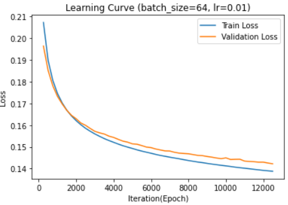
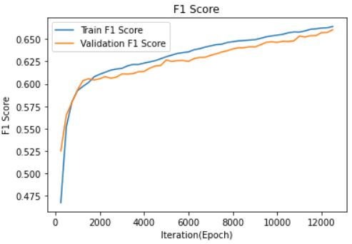
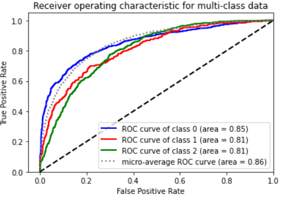
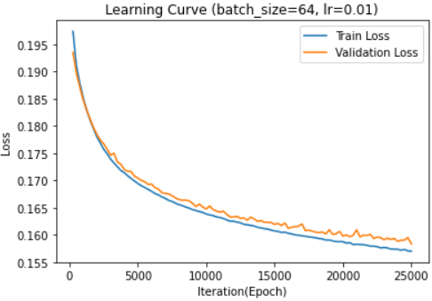
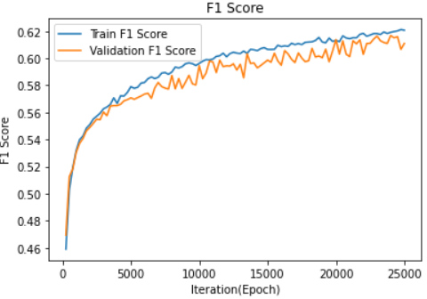
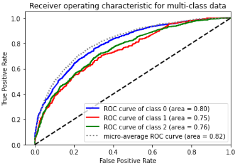

# Deep Learning Sentiment Classifier: FFNN & GloVe Optimization

This repository contains a comprehensive study on optimizing FeedForward Neural Networks (FFNN) for sentiment analysis. The project compares traditional sparse vectorization (TF-IDF) against dense pre-trained embeddings (GloVe) across various architectural configurations.

## 🔬 Architectural Ablation Study

I systematically experimented with the following parameters to find the "Global Optimum" for this specific dataset:
* **Activations:** ReLU vs. Sigmoid
* **Optimizers:** SGD vs. ASGD (Averaged Stochastic Gradient Descent)
* **Depth:** 0 to 3 Hidden Layers
* **Embeddings:** Sparse (Count/TF-IDF) vs. Dense (GloVe 50d-300d)

---

## 📊 Phase 1: Sparse Input Models (Count/TF-IDF)

Starting with a high-dimensional input layer (**32,656 features**), the baseline model struggled with convergence and overfitting.

### Optimization 1: Learning Rate & Momentum Tuning
By adjusting the learning rate to `0.01` and implementing **Nesterov Momentum (0.7)**, the training and validation curves stabilized significantly.

<p align="center">
    
    
    
</p>

### Optimization 2: Architectural Depth
Surprisingly, for sparse vectors, adding hidden layers led to **aggressive overfitting** rather than better accuracy.
* **Conclusion:** For the linear separability of this sparse data, a **0-hidden-layer model** (Softmax Regression) matched the data shape better than deep architectures.

<p align="center">
    
</p>

---

## 🌍 Phase 2: Dense Input Models (GloVe Embeddings)

Transitioning to **GloVe 300d embeddings** required a deeper network to capture the non-linear relationships in the dense vector space.


### Finding the "Sweet Spot"
After testing various depths, I identified that **1 Hidden Layer (300 units)** provided the optimal balance between feature extraction and generalization.

### Optimizer Comparison: SGD vs. ASGD
Switching from standard SGD to **ASGD** provided a smoother optimization landscape and better F1 scores on the validation set.

**Final Optimized GloVe Model (ASGD, LR 0.01, Sigmoid):**
<p align="center">
    
    
    
</p>

---

## 🚀 Key Engineering Insights

1. **Embedding Dimensionality:** Higher dimensions (300d vs 50d) consistently outperformed smaller vectors by providing richer semantic context for the model.
2. **The "Overfitting Threshold":** In dense networks, ReLU was more prone to instability than Sigmoid, which acted as a natural regularizer in this specific shallow-to-medium depth setup.
3. **Loss Function Impact:** Transitioning to **CrossEntropyLoss** from MSE significantly improved the probabilistic interpretation of the output classes.


---
## 🎓 Academic Context
Developed as part of the Artificial Intelligence I course at the National and Kapodistrian University of Athens (UoA). Based on the UC Berkeley CS188 framework.

## 🚦 Setup & Usage
```bash
# Install PyTorch and ML suite
pip install torch pandas scikit-learn nltk numpy matplotlib

# Execute the neural network trainer
python main.py
