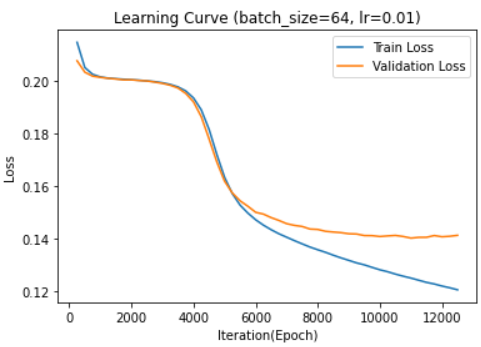
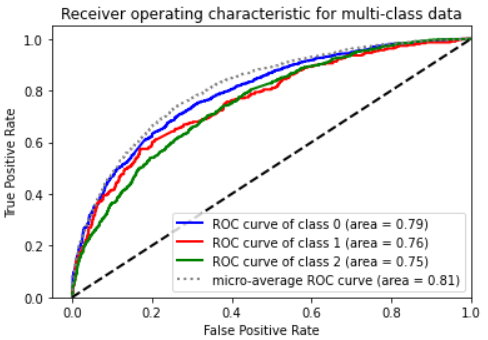

# Iliopoulos Nikolaos - 1115201800332

## AI 2 Exersice 2 - FeedForward Neural Network

## Table of Contents

1. [General Info (page 1)](#GeneralInfo)
2. [Models without GloVe (page 1-7)](#section1)

   2.1. [Learing Rate 0.1](#section1_1)

   2.2. [Learing Rate 0.01](#section1_2)

   2.3. [Vectorizer parameters](#section1_3)

   2.4. [Momentum & nesterov](#section1_4)

   2.5. [1 Hidden Layer](#section1_5)
   
   2.6. [2 Hidden Layer](#section1_6)

   2.7. [3 Hidden Layer](#section1_7)

   2.8. [MSELoss->CrossEntropyLoss](#section1_8)

   2.9. [CountVectorizer->TfidfVectorizer](#section1_9)

3. [Models with GloVe (page 7-12)](#section2)

   3.1. [1 Hidden Layer](#section2_1)

   3.2. [2 Hidden Layer](#section2_2)

   3.3. [3 Hidden Layer](#section2_3)

   3.4. [activation relu->sigmoid](#section2_4)

   3.5. [optimizer SGD->ASGD](#section2_5)

   3.6. [Different GloVe dimensions](#section2_6)

### General Info <a name="GeneralInfo"></a>

I experimented with:

- Activation Functions: **relu, sigmoid**
- Learning Rates: **0.1, 0.01, 0.001, 0.00001**
- Momentum: **0.1 ~ 0.9** with and without nesterov
- Loss Functions: **MSELoss, CrossEntropyLoss**
- Optimizers: **SGD, ASGD**
- Batch Size: **32, 64, 128**
- Vectorizers: **CountVectorizer, TfidfVectorizer, GloVe(50d, 300d)**
- Number Of Epochs: **50 ~ 100**
- Number Of Hidden Layers: **0 ~ 3**
- Number Of Neurons In Hidden Layers: **50 ~ 800**

The Number of neurons in the output layer stays **3** as the number of classes is 3.

The Number of neurons in the input layer is based on the vectorizer that is used.

- TfidfVectorizer & CountVectorizer: **2200 ~ 32456** depends on the parameters (min_df, stop_words, lowercase)
- GloVe: **50, 100, 200, 300**

### Models without GloVe <a name="section1"></a>

I started with 0 Hidden Layers. Just a simple feedforward neural network with softmax in the last layer to convert the output to probabilities.

```python
class Net(nn.Module):
    def __init__(self, D_in, D_out):
        super(Net, self).__init__()
        self.lin1 = nn.Linear(D_in, D_out)

    def forward(self, x):
        out = self.lin1(x)
        return nn.functional.softmax(out,dim=1)
```

Starting values:

- Count Vectorizer returned 32656 features. **input layer = 32656**
- Learning Rate: **0.00001**
- Number of Epoch: **50**
- Batch Size: **64**
- Loss: **MSELoss**
- Optimizer: **SGD**

<p align="center">
    
    
    
</p>

This model is not performing very well. Basically it is learning very slowly.

---

I tried to increase the learning rate. A very big learning rate was making the model to learn faster but in the long run the model was overfitting a bit.

**Learing Rate 0.1** <a name="section1_1"></a>

<p align="center">
    
</p>

F1 Score ~0.75 on train and ~0.70 validation set.
This model is overfitting a bit.

---

**Learing Rate 0.01** <a name="section1_2"></a>

<p align="center">
    
    
    
</p>

F1 Score ~0.64 on both train and validation set.
0.01 seems to be the perfect learning rate in order to not overfit and have high F1 Score.
We can also see that the ROC Curve is much better than the starting model.
I will keep the learning rate of **0.01** cause it is not overfitting and the F1 Score is high on both train and validation set.

---
<a name="section1_3"></a>
The input layer size is very big(32656). So the complexity of the model is high.
I will try to reduce is with min_df=0.001 stop_words="english" and lowercase=True in the count vectorizer.
Now the count vectorizer return **1524 features.**

<p align="center">
    
    
    
</p>

This change made the train and validation learning curves come even closer.

---
<a name="section1_4"></a>
I experimented with momentum values to help the model to learn faster.
I decided that **momentum 0.7** and **nesterov=True** is the best combination for my case.
Momentum help changing the weights of the model based of the previus changes.

<p align="center">
    
    
    
</p>

This change made the train and validation learning curves come even closer.

---
I starter expiriment with the number of hidden layers.

**With 1 Hidden Layer and relu activation function.**

<a name="section1_5"></a>

```python
class Net(nn.Module):
    def __init__(self, D_in,H1, D_out):
        super(Net, self).__init__()
        self.lin1 = nn.Linear(D_in, H1)
        self.lin2 = nn.Linear(H1, D_out)

    def forward(self, x):
        out = nn.functional.relu(self.lin1(x))

        return nn.functional.softmax(self.lin2(out),dim=1)
```
I tested with different hidden layer sizes.
These graphs is for size **100**.

<p align="center">
    
    
    
</p>

These graphs is for size **800**.

<p align="center">
    
    
    
</p>

There was not a big change in the learning curve or in the F1 Score.

**With 2 Hidden Layer and relu activation function.**

<a name="section1_6"></a>

```python
class Net(nn.Module):
    def __init__(self, D_in,H1,H2, D_out):
        super(Net, self).__init__()
        self.lin1 = nn.Linear(D_in, H1)
        self.lin2 = nn.Linear(H1, H2)
        self.lin3 = nn.Linear(H2, D_out)

    def forward(self, x):
        out = nn.functional.relu(self.lin1(x))
        out = nn.functional.relu(self.lin2(out))

        return nn.functional.softmax(self.lin3(out),dim=1)
```

I tested with different hidden layer sizes.
These graphs is for size H1=**800** H2=**400**.

<p align="center">
    
    
    
</p>

We can see that this model is **overfitting a bit**. Cause these layers with these neurons are not matching with the shape of our data.

These graphs is for size H1=**200** H2=**100**.

<p align="center">
    
    
    
</p>

We can see that this model is **overfitting a bit** as well.

These graphs is for size H1=**100** H2=**100**.

<p align="center">
    
    
    
</p>

We can see that this model is **overfitting a bit** as well.

**With 3 Hidden Layer and relu activation function.**

<a name="section1_7"></a>

```python
class Net(nn.Module):
    def __init__(self, D_in,H1,H2,H3, D_out):
        super(Net, self).__init__()
        self.lin1 = nn.Linear(D_in, H1)
        self.lin2 = nn.Linear(H1, H2)
        self.lin3 = nn.Linear(H2, H3)
        self.lin4 = nn.Linear(H3, D_out)

    def forward(self, x):
        out = nn.functional.relu(self.lin1(x))
        out = nn.functional.relu(self.lin2(out))
        out = nn.functional.relu(self.lin3(out))

        return nn.functional.softmax(self.lin4(out),dim=1)
```

I tested with different hidden layer sizes.
These graphs is for size H1=**200** H2=**100** H3=**50**.

<p align="center">
    
    
    
</p>

We can see that the **overfit** here is bigger. And the ROC Curve is worse for the class 1.

We can also see that when we increase the number of hidden layers, the model is **overfitting** more and more.
These is because our data is not so complex. We dont have a deep network.

> **I came to a conclusion that the hidden layers did not help improve the scores at all. But only made the loss of the train and validation have a bigger gap(overfit a little)**

> **I will keep the model with 0 hidden layers as it matches better the shape of the data.**

---
<a name="section1_8"></a>

I tried to change the loss function to **Cross Entropy Loss** but it made the loss of the train and validation worse.

<p align="center">
    
    
    
</p>

Loss jumped from **0.12** to **0.65**!!

---
<a name="section1_9"></a>

I tried to epxeriment with TfidfVectorizer and see the differences.

```python
TfidfVectorizer(
    strip_accents='unicode',
    ngram_range=(1, 1),
    min_df=0.001,
    stop_words=text.ENGLISH_STOP_WORDS,
    lowercase=True
    )
```

<p align="center">
    
    
    
</p>

We can see that the Loss of the train and validation **is much closer** but also is a little bit higher from **0.13** to **0.17**.(Small change but still it is an increase)
Also the ROC Curve Area is a little bit worse from **0.81** to **0.77** of the class 2 and **0.79** for class 1.
Also the F1 Score of the train and validation is same. CountVectorizer had a bit of a gap in the F1 Score.

> **I will say that TfidfVectorizer is not better that countVectorizer but it is not worse either.**

### Models with GloVe <a name="section2"></a>

- GloVe embedding with the 300 dimensions file.(i choosed the 300d vs the othes cause more feautures means more information)
- 0 Hidden Layer.
- For every word in the sentence, i summed it to an 1x300 array.
- learning rate=0.01,momentum=0.9, nesterov=True

<p align="center">
    
    
    
</p>

We can see that with the GloVe Embending the graphs are very bad cause our data is not linear and we havent used any hidden layer.

---

I started to experiment with more Hidden Layers to optimize my results.

**1 Hidden Layer with relu activation function.**

<a name="section2_1"></a>

```python
class Net(nn.Module):
    def __init__(self, D_in, H1, D_out):
        super(Net, self).__init__()
        self.lin1 = nn.Linear(D_in, H1)
        self.lin2 = nn.Linear(H1, D_out)

    def forward(self, x):
        out = nn.functional.relu(self.lin1(x))

        return nn.functional.softmax(self.lin2(out),dim=1)
```

These graphs is for size H1=**100**.

<p align="center">
    
    
    
</p>

We can see that this model is **overfitting** but clearly this model is a little bit better than the one with 0 hidden layer.

In order to improve the overfit i will lower the learning rate from **0.01** to **0.0001** & epoch from **50** to **100** in roder to give it more time and i got those results.

<p align="center">
    
    
    
</p>

These graphs is for size H1=**300**.

<p align="center">
    
    
    
</p>

We can see that this model is well fitted with a good F1 Score(0.60) and a good ROC Curve Area(avg 0.81).

These graphs is for size H1=**600**.

<p align="center">
    
    
    
</p>

We can see that this model is not any different from the one with 300 neurons. So i will keep the 300 neurons and add a second hidden layer to the model.

**2 Hidden Layer with relu activation function.**

<a name="section2_2"></a>

```python
class Net(nn.Module):
    def __init__(self, D_in, H1,H2, D_out):
        super(Net, self).__init__()
        self.lin1 = nn.Linear(D_in, H1)
        self.lin2 = nn.Linear(H1, H2)
        self.lin3 = nn.Linear(H2, D_out)

    def forward(self, x):
        out = nn.functional.relu(self.lin1(x))
        out = nn.functional.relu(self.lin2(out))

        return nn.functional.softmax(self.lin3(out),dim=1)
```

These graphs is for size H1=**300** H2=**300**.

<p align="center">
    
    
    
</p>

Did not see any significant changes in this model. Just a little bit bigger loss and lower F1 Score. But very small changes. Still the 1 hidden layer with 300 neurons is the best model so far.

These graphs is for size H1=**300** H2=**150**.

<p align="center">
    
    
    
</p>

We can see that this model has lower F1 Score and the same loss.

> I will experiment with a third hidden layer to see what will change.

**3 Hidden Layer with relu activation function.**

<a name="section2_3"></a>

```python
class Net(nn.Module):
    def __init__(self, D_in, H1,H2,H3, D_out):
        super(Net, self).__init__()
        self.lin1 = nn.Linear(D_in, H1)
        self.lin2 = nn.Linear(H1, H2)
        self.lin3 = nn.Linear(H2, H3)
        self.lin4 = nn.Linear(H3, D_out)

    def forward(self, x):
        out = nn.functional.relu(self.lin1(x))
        out = nn.functional.relu(self.lin2(out))
        out = nn.functional.relu(self.lin3(out))

        return nn.functional.softmax(self.lin4(out),dim=1)
```

These graphs is for size H1=**300** H2=**200** H3=**100**.

<p align="center">
    
    
    
</p>

We can clearly see that this model is not pefroming well.
The ROC Curve for the class 1 has area 0.50.
The F1 Score has dropped to 0.56.

> **The sweet spot for the GloVe embedding model is 1 hidden layer with 300 neurons.**

---

I will now experiment in changing the activation function from relu to sigmoid.

<a name="section2_4"></a>

<p align="center">
    
    
    
</p>

We can see that this model is more stable during the training than the model with relu.
And we get the same loss but a little lower F1 Score.
But if we increase our learning rate a bit e will get bigger F1 Score without overfitting.

Learning rate from **0.0001** to **0.001**.

<p align="center">
    
    
    
</p>

We can see that with this change we got the higher F1 Score and the lower loss and better ROC Curve Area. It might be a little bit more unstable in the training in every epoch but it gives better results.

---

I will now experiment in changing the optimizer from SGD to ASGD.

<a name="section2_5"></a>

<p align="center">
    
    
    
</p>

We can see that this model has train loss closer to the validation loss.
The same with the F1 Score. But lower F1 Score.
And lower ROC Curve Area than before.
But because it is more stable in the training i will increase the learning rate to make it learn better and faster.

Learning rate from **0.001** to **0.01**.

<p align="center">
    
    
    
</p>

With this increase we got lower loss, higher F1 Score and higher ROC Curve Area.

> **This is the best model so far**

---

<a name="section2_6"></a>

I want to try out the other GloVe dimension sizes.

These graphs is for glove size 50 and lower the neurons of my layer to 50.

<p align="center">
    
    
    
</p>

I can see that with more features the model perfoms better.

> **So my best model is the previous one**